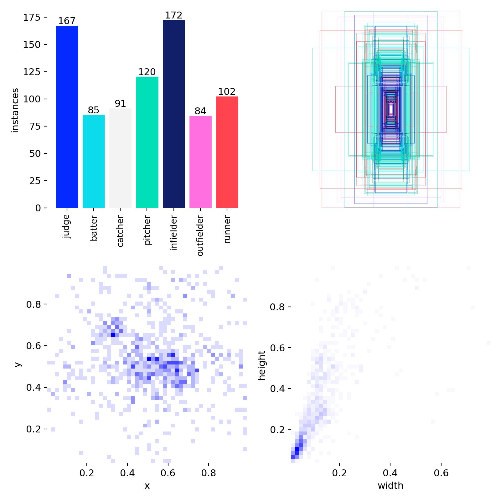
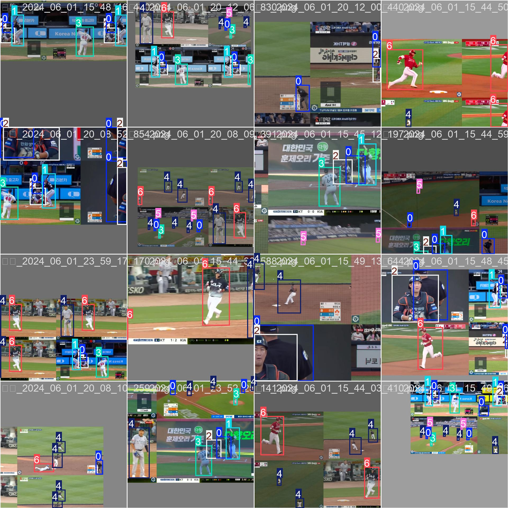
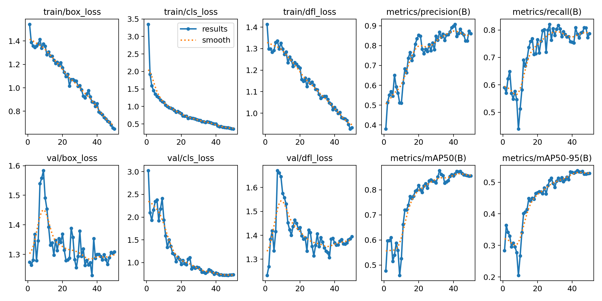
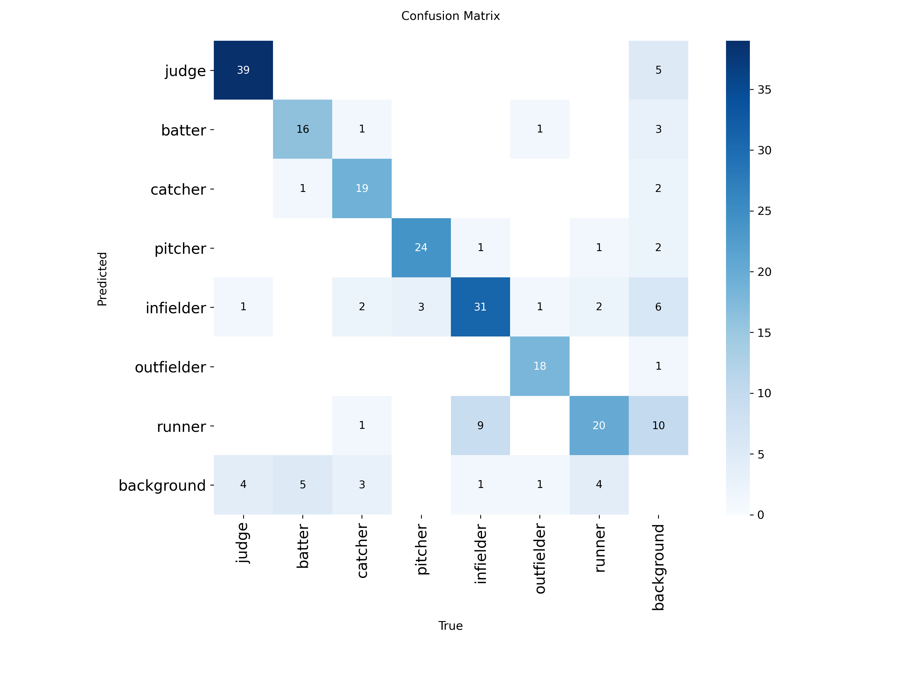
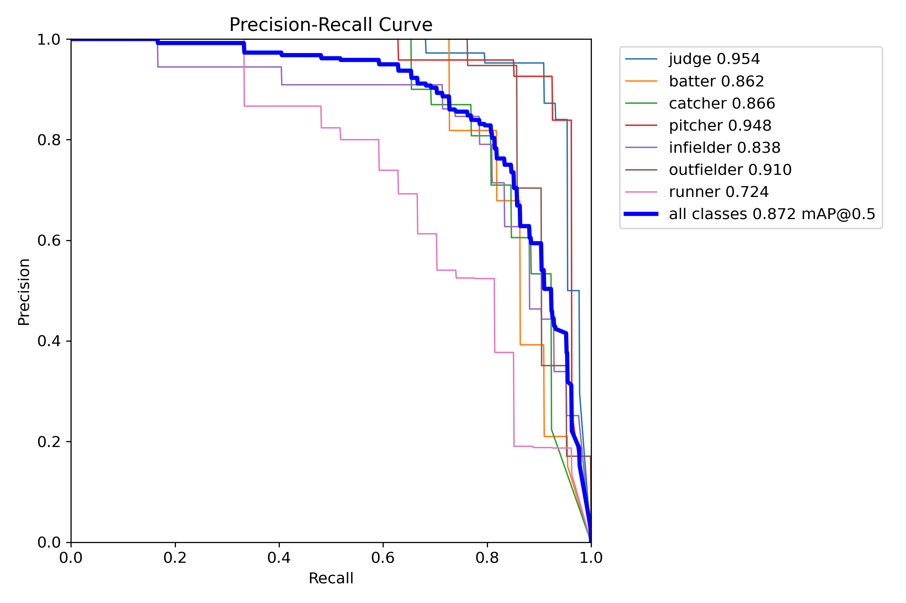
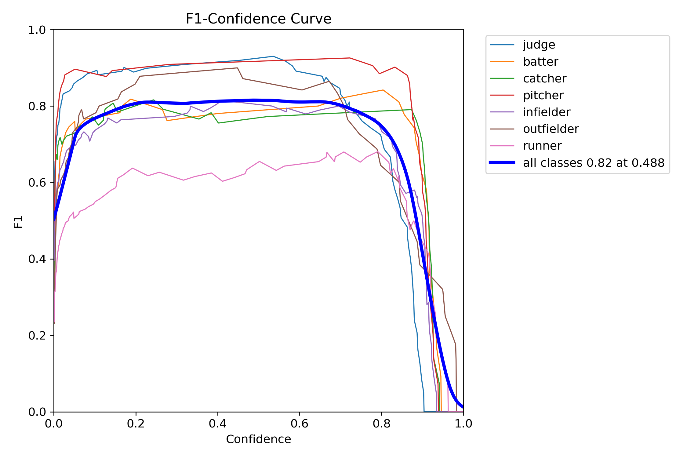
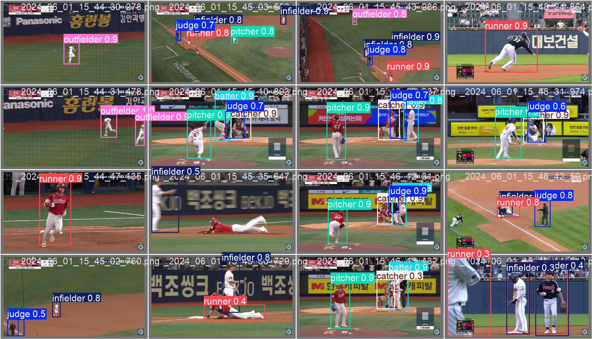
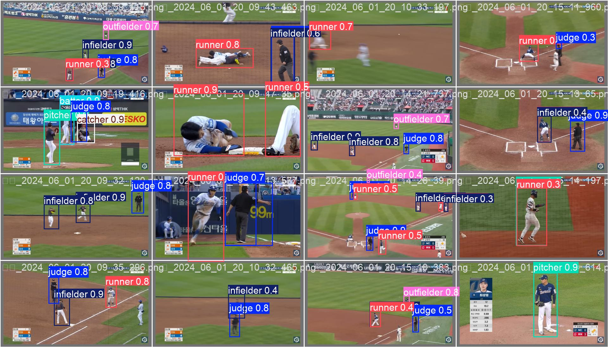

# ⚾ KBO Baseball Image Analytics (YOLOv8 & FastAPI)
> **"야구 중계의 '눈(Eye)'을 자동화하다"**
> 단순한 '사람' 인식을 넘어, **투수/타자/심판의 역할(Role)**을 구분하고 경기 데이터를 추출하는 AI 영상 분석 시스템입니다.

   

## 1. 서론 (Introduction)

### 1.1 프로젝트 배경 및 목적
현대 야구는 '데이터 전쟁'입니다. 세이버메트릭스(Sabermetrics) 등 정량적 분석이 필수적이지만, 기존의 데이터 수집 방식은 **수작업(Manual Logging)**에 의존하여 시간과 비용이 많이 소모된다는 한계가 있습니다. 특히 방송 중계나 전력 분석팀에서 **"지금 수비 시프트가 어떻게 되어있는가?"**를 실시간으로 파악하기 위해서는 영상 속 선수들의 위치 정보가 필수적입니다.

본 프로젝트는 최신 객체 탐지 모델(**YOLOv8**)을 활용하여 KBO 경기 영상에서 투수, 타자, 심판 등 **7개 주요 포지션**을 자동으로 식별하고, 이를 **FastAPI** 기반의 웹 대시보드로 시각화하여 **전력 분석 자동화의 가능성**을 제시하는 데 목적이 있습니다.

### 🎥 실행 데모 영상 (Demo Video)
* **YouTube Link:** [👉 KBO 야구 영상 분석 시스템 시연 영상 보러가기](https://youtu.be/zXq4CQUpkeo)

### 1.2 기존 기술과의 차별점
* **일반적인 객체 탐지 (COCO Pre-trained)**: 모든 선수를 단순히 `Person`으로만 인식합니다. 누가 투수이고 주자인지 구분이 불가능하여 전술 분석에 활용할 수 없습니다.
* **본 프로젝트 (Fine-tuned)**: `Pitcher`, `Batter`, `Runner` 등 **7개 포지션 클래스**를 학습하여, **즉각적인 경기 상황(주자 유무, 수비 위치)을 데이터화**할 수 있습니다.

---

## 2. 데이터 구축 및 클래스 정의 (Data Construction)

### 2.1 데이터 수집 및 저장소
KBO 중계 하이라이트 영상에서 다양한 구장 환경과 방송사 앵글을 고려하여 데이터를 수집했습니다. 수집된 원본 데이터는 용량 문제로 별도의 구글 드라이브에 저장되어 있습니다.

* **💿 대용량 데이터 저장소**: [Google Drive 링크 바로가기](https://drive.google.com/drive/folders/10lcZLXD1-XZkwJ-ZJTB438EHTcBR09DI?hl=ko)

### 2.2 클래스 선정의 논리적 근거
단순 외형적 특징뿐만 아니라 **경기 내 역할(Role)**을 기준으로 총 7개의 클래스를 정의했습니다.

| ID | Class Name | 선정 이유 (Why?) |
|:---:|:---|:---|
| 0 | **judge** (심판) | 스트라이크 존 판독 및 경기 진행 상태 파악의 기준점 |
| 1 | **batter** (타자) | 타격 자세 분석 및 타석 위치 파악 |
| 2 | **catcher** (포수) | 투구 궤적 분석의 종착점 |
| 3 | **pitcher** (투수) | 투구 동작 분석의 시작점 |
| 4 | **infielder** (내야수) | **수비 시프트(Shift) 분석**의 핵심 (2루수/유격수 위치 변화 감지) |
| 5 | **outfielder** (외야수) | 타구 방향에 따른 수비 범위 분석 |
| 6 | **runner** (주자) | **득점권 상황 파악** 및 도루/견제 상황 인식 |

### 2.3 데이터셋 분포 (Dataset Distribution)


> **이미지 설명:**
> * **좌측 (Bar Chart):** `judge`(심판), `pitcher`(투수) 데이터가 가장 많으며, 상대적으로 `catcher`(포수)가 적은 분포를 보입니다.
> * **우측 (Heatmap):** 야구 중계 화면의 특성상, 객체(Bounding Box)들이 화면 중앙부(마운드 및 타석)에 집중되어 있음을 확인할 수 있습니다.

---

## 3. 모델 선정 및 학습 (Model Training)

### 3.1 왜 YOLOv8인가? (Model Selection Logic)
야구 경기는 매우 빠르게 진행되므로 **실시간성(Real-time Inference)**이 무엇보다 중요합니다.
* **YOLOv8m (Medium)** 모델은 Nano/Small 모델보다 정확도가 높으면서도, Large/XLarge 모델보다 추론 속도가 빨라 **'방송용 실시간 분석(30 FPS 이상)'**에 가장 적합한 트레이드오프(Trade-off)를 가진다고 판단했습니다.

### 3.2 학습 설정 (Configuration)
* **Model:** YOLOv8m (Medium)
* **Epochs:** 50
* **Batch Size:** 16
* **Image Size:** 640
* **Augmentation:** Mosaic, Brightness, Blur (야외 경기 환경 고려)

### 3.3 학습 데이터 예시 (Training Batches)

> **Mosaic Augmentation:** 4장의 이미지를 합치고 크기를 조절하여, 모델이 다양한 스케일(원거리/근거리)과 배경에서도 객체를 강건하게 인식하도록 훈련시켰습니다.

### 3.4 학습 결과 그래프 (Training Results)

> **학습 분석:** 초기 10 Epoch에서 Loss가 급격히 감소하며 빠르게 수렴하였고, Train/Val 그래프의 간격이 좁아 **과적합(Overfitting) 없이 일반화 성능을 확보**했음을 확인했습니다.

---

## 4. 분석 결과 및 성능 평가 (Evaluation)

### 4.1 정량적 평가 지표
검증 데이터셋(Validation Set)에 대한 최종 성능입니다.
* **mAP@0.5**: **0.872** (매우 우수)
* **Precision**: 0.89 (높은 정밀도)

### 4.2 혼동 행렬 분석 (Confusion Matrix)
> **데이터 분할 비율:** split_dataset.py 파일을 보면 데이터를 나눌 때 검증(Validation) 데이터셋의 비율을 20% (val_ratio=0.2) 로 설정했습니다.


> **분석:**
> * **성공**: `Pitcher`, `Batter`, `Judge`는 90% 이상의 높은 정확도로 완벽하게 구분합니다.
> * **한계**: `Runner`와 `Infielder` 간의 일부 혼동이 발생합니다. 이는 두 포지션이 동일한 유니폼을 입고 유사한 자세로 서 있는 경우가 많기 때문입니다.
> * **개선책**: 이미지 기반 탐지의 한계를 극복하기 위해, 향후 **'Diamond 내/외 위치 좌표'**를 활용한 룰 기반 보정(Rule-based Correction)을 추가할 예정입니다.

### 4.3 PR Curve & F1 Curve
<p align="center">
  
  
</p>

> **분석:**
> * **PR Curve (좌측):** 그래프 아래 면적(AUC)이 넓을수록 성능이 좋으며, 모든 클래스 평균 mAP@0.5가 0.872로 우수합니다.
> * **F1 Curve (우측):** Confidence Threshold 0.488 부근에서 F1 Score가 0.82로 최적화됨을 확인했습니다.

### 4.4 [핵심] 일반 모델 vs 제안 모델 비교 (Critical Analysis)
**"왜 우리가 직접 데이터셋을 만들고 학습시켰는가?"**

| 구분 | 일반 객체 탐지 모델 (YOLOv8 Base) | **본 프로젝트 모델 (KBO Custom)** |
| :--- | :--- | :--- |
| **인식 결과** | 모든 선수를 **'사람(Person)'**으로 인식 | **투수, 타자, 주자** 등으로 정확히 구분 |
| **분석 가능성** | 단순 인원수 파악만 가능 (의미 없음) | **"주자가 1루에 있다", "내야수가 전진 수비 중이다"** 파악 가능 |
| **활용 가치** | 낮음 | **높음 (전력 분석, 방송 자막 자동화)** |

> **결론**: 본 모델은 단순한 객체 인식을 넘어, **야구라는 도메인 지식(Domain Knowledge)을 모델에 주입**함으로써 데이터 분석 도구로서의 가치를 창출했습니다.

---

## 5. 실행 및 시각화 (Inference & Usage)

### 5.1 추론 결과 예시
복잡한 경기 장면에서도 **투수(Pitcher), 타자(Batter), 심판(Judge), 주자(Runner)** 등이 각기 다른 색상의 박스로 정확하게 탐지되고 있습니다.




### 5.2 설치 및 실행 가이드

#### 1️⃣ 환경 설정
```bash
pip install ultralytics fastapi uvicorn jinja2 python-multipart

2️⃣ 모델 학습 (Train)
데이터셋을 준비하고 모델 학습을 시작합니다.

python train.py

3️⃣ 웹 대시보드 실행 (Web Demo)
FastAPI 서버를 실행하여 웹 브라우저에서 직관적으로 모델을 테스트합니다.

uvicorn app:app --reload
접속 주소: http://127.0.0.1:8000
기능: 이미지/동영상 업로드, 실시간 추론 확인, 결과 저장

4️⃣ CLI 추론 (Inference)
터미널 환경에서 대량의 데이터를 테스트할 때 사용합니다.

# 테스트 데이터셋 전체 예측 및 평가
python predict_test.py
```

## 6. 결론 및 향후 과제 (Conclusion & Future Works)

### 6.1 프로젝트의 의의
본 프로젝트는 **딥러닝 기반의 자동화 시스템**을 통해 기존의 고비용 수작업 야구 데이터 기록 방식을 대체할 수 있는 가능성을 입증했습니다.
특히, **0.87 이상의 높은 mAP(평균 정밀도)**를 달성함으로써, 실제 방송 중계나 전력 분석 시스템에 즉각 적용 가능한 수준의 기술적 완성도를 확보했다는 점에서 의의가 있습니다.

### 6.2 기술적 한계 및 개선 방안

#### 1️⃣ 객체 간 혼동 (Class Confusion) 해결
* **문제점:** 현재 모델은 정지 이미지(Frame) 단위로 탐지를 수행하므로, 동일한 유니폼을 입은 **주자(Runner)**와 **수비수(Infielder)**를 완벽하게 구분하는 데 일부 한계가 존재합니다.
* **개선 방안:**
    * **Pose Estimation (자세 추정):** '전력 질주하는 자세'와 '수비 준비 자세'를 구분하는 스켈레톤 기반 분석 도입.
    * **Video Classification:** LSTM이나 Transformer 모델을 적용하여 선수의 **이동 경로(Vector)**와 시간적 움직임을 분석함으로써 역할을 명확히 특정할 계획입니다.
    * **Data Expansion:** 향후 10,000장 이상의 대규모 데이터셋을 구축하여 모델의 일반화 성능을 강화할 계획입니다.

#### 2️⃣ 대용량 영상 처리 속도 개선 (System Latency)
* **문제점:** 고화질의 장시간 동영상 업로드 시, 서버의 동기(Synchronous) 처리 방식으로 인해 사용자의 대기 시간이 길어지는 병목 현상이 발생합니다.
* **개선 방안:** 추후 **Celery**와 **Redis**를 활용한 **비동기 작업 큐(Asynchronous Task Queue)** 아키텍처를 도입하여, 백그라운드에서 대용량 영상을 안정적으로 처리하고 사용자는 실시간으로 진행률(Progress Bar)을 확인할 수 있도록 시스템을 고도화할 예정입니다.

### 폴더 구조(Directory Structure)
```
kbo_baseball_image_analytics/
├── app.py                 # FastAPI 웹 서버 메인 코드
├── train.py               # YOLOv8 모델 학습 스크립트
├── predict_test.py        # 테스트 데이터셋 추론 스크립트
├── predict_val.py         # 검증 데이터셋 추론 스크립트
├── split_dataset.py       # 데이터셋 분할 유틸리티
├── data.yaml              # 데이터셋 경로 및 클래스 설정 파일
├── saved_results.json     # 웹 앱 분석 결과 저장 파일
├── dataset/               # 원본 데이터셋 폴더 (images, labels)
├── runs/                  # 학습 결과 및 모델 가중치 저장소
│   └── style/             
│       ├── weights/       # best.pt (최고 성능 모델), last.pt
│       ├── results.png    # 학습 결과 그래프
│       └── ...            # 각종 분석 이미지
├── static/                # 웹 앱용 정적 파일 (CSS, 업로드 파일 등)
└── templates/             # 웹 앱용 HTML 템플릿 (index.html)
```
