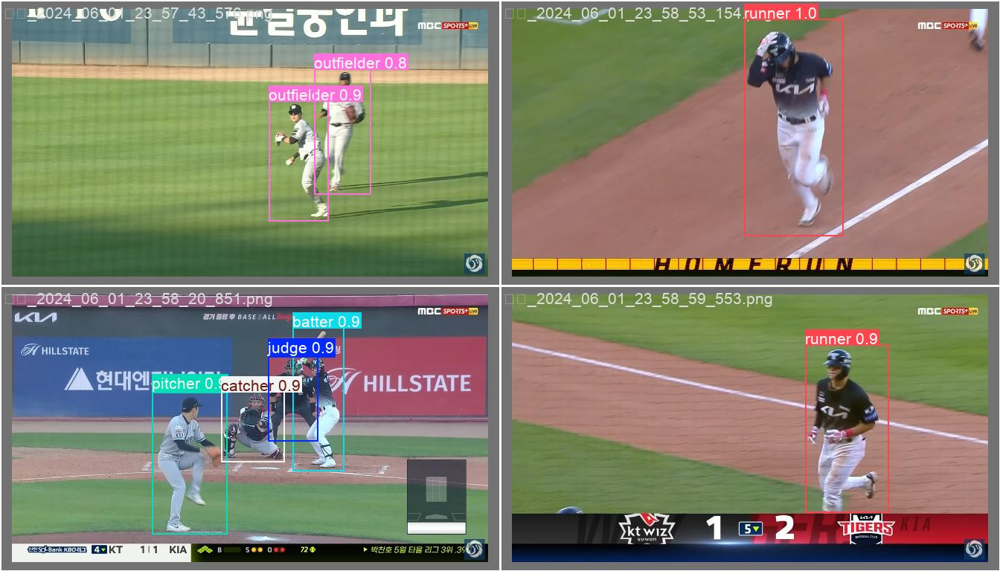

# ⚾ KBO Baseball Image Analytics (YOLOv8 & FastAPI)


## 1. 프로젝트 개요 (Overview)
본 프로젝트는 **KBO 리그 야구 경기 하이라이트 영상**에서 투수, 타자, 심판 등 **7개 주요 포지션**을 자동으로 식별하는 딥러닝 객체 탐지(Object Detection) 모델을 개발하고, 이를 쉽게 활용할 수 있는 **웹 대시보드**를 제공합니다.

`YOLOv8m` 모델을 기반으로 학습하여 높은 정확도를 확보하였으며, `FastAPI`를 통해 사용자가 직접 이미지나 동영상을 업로드하고 분석 결과를 시각적으로 확인할 수 있습니다.

---
### 2. 데이터 저장소
수집된 원본 데이터는 용량 문제로 인해 별도의 구글 드라이브에 저장하였다.(전체적인 프로젝트의 파이썬 및 데이터 등 전부 저장하였다.)
* **대용량 데이터 저장소**: [Google Drive 링크](https://drive.google.com/drive/folders/16iDWNRGRV3p_oI1JLGJ9MXyGEnriKlk8?hl=ko](https://drive.google.com/drive/folders/10lcZLXD1-XZkwJ-ZJTB438EHTcBR09DI?hl=ko))
## 2.2 데이터셋 및 클래스 (Dataset & Classes)
KBO 경기 영상에서 추출한 이미지를 사용하여 7개의 클래스로 라벨링하였습니다.

### 📌 클래스 분포 및 데이터 (Labels & Instances)

> **이미지 설명:** > * **좌측 상단 (Bar Chart):** 각 클래스별 데이터 개수를 보여줍니다. `judge`(심판), `pitcher`(투수) 등의 데이터가 많고, 상대적으로 `catcher`(포수) 등이 적은 분포를 확인할 수 있습니다.
> * **우측 (Heatmap):** 이미지 내에서 객체(Bounding Box)들이 주로 위치하는 좌표와 크기 분포를 나타냅니다. 야구 경기 특성상 중앙에 객체가 집중되어 있음을 알 수 있습니다.

| ID | Class Name | 설명 |
|:---:|:---|:---|
| 0 | **judge** | 심판 (주심 및 루심) |
| 1 | **batter** | 타자 |
| 2 | **catcher** | 포수 |
| 3 | **pitcher** | 투수 |
| 4 | **infielder** | 내야수 (1, 2, 3루수, 유격수) |
| 5 | **outfielder** | 외야수 (좌, 중, 우익수) |
| 6 | **runner** | 주자 |

---

## 3. 모델 학습 (Model Training)
* **Model:** YOLOv8m (Medium)
* **Epochs:** 50
* **Batch Size:** 16
* **Image Size:** 640

### 🖼️ 학습 데이터 예시 (Training Batches)

> **이미지 설명:** > YOLOv8 학습 시 적용된 **Mosaic Augmentation** 결과입니다. 4장의 이미지를 합치고 크기를 조절하여 모델이 다양한 스케일과 배경에서도 객체를 잘 인식하도록 훈련시키는 과정입니다.

### 📈 학습 결과 그래프 (Training Results)

> **이미지 설명:**
> Epoch(학습 횟수) 진행에 따른 성능 변화 그래프입니다.
> * **Train/Val Loss (좌측):** 학습이 진행될수록 손실값(오차)이 꾸준히 감소하며 모델이 안정적으로 학습되고 있음을 보여줍니다.
> * **Metrics (우측):** Precision(정밀도), Recall(재현율), mAP(평균 정밀도) 지표가 우상향하며 성능이 개선되는 것을 확인할 수 있습니다.

---

## 4. 성능 평가 (Evaluation)
검증 데이터셋(Validation Set)에 대한 정량적 평가 결과입니다.

### 📊 혼동 행렬 (Confusion Matrix)

> **이미지 설명:**
> 모델의 예측 결과와 실제 정답(True Label)을 비교한 행렬입니다.
> * **대각선 (진한 파란색):** 올바르게 예측한 비율입니다. `pitcher`, `batter`, `judge` 등 특징이 뚜렷한 클래스는 0.89 이상의 매우 높은 정확도를 보입니다.
> * **비대각선:** 잘못 예측한 사례입니다. 예를 들어 `runner`가 `infielder`로 일부 오인식되는 경향 등을 파악할 수 있습니다.

### 📉 PR Curve & F1 Curve
<p align="center">
  
  
</p>

> **이미지 설명:**
> * **PR Curve (좌측):** Precision과 Recall의 관계를 보여줍니다. 그래프 아래 면적(mAP)이 넓을수록 성능이 좋으며, 모든 클래스 평균 mAP@0.5가 **0.872**로 우수한 성능을 나타냅니다.
> * **F1 Curve (우측):** Confidence Threshold에 따른 F1 Score 변화입니다. 신뢰도 0.488 부근에서 모든 클래스의 F1 점수가 최적화됨(0.82)을 보여줍니다.

---

## 5. 예측 결과 시각화 (Inference Examples)
학습된 모델을 사용하여 실제 경기 장면을 추론한 결과입니다.




> **이미지 설명:**
> 실제 검증 데이터에 대한 추론 결과입니다. 복잡한 경기 장면에서도 **투수(Pitcher), 타자(Batter), 심판(Judge), 주자(Runner)** 등이 각기 다른 색상의 박스로 정확하게 탐지되고 있음을 시각적으로 확인할 수 있습니다.

---

## 6. 설치 및 실행 (Installation & Usage)
```bash
1️⃣ 환경 설정
필요한 라이브러리를 설치합니다.

pip install ultralytics fastapi uvicorn jinja2 python-multipart

2️⃣ 모델 학습 (Train)
데이터셋을 준비하고 모델 학습을 시작합니다.

python train.py

3️⃣ 웹 대시보드 실행 (Web Demo)
FastAPI 서버를 실행하여 웹 브라우저에서 직관적으로 모델을 테스트합니다.

uvicorn app:app --reload
접속 주소: http://127.0.0.1:8000
기능: 이미지/동영상 업로드, 실시간 추론 확인, 결과 저장

4️⃣ CLI 추론 (Inference)
터미널 환경에서 대량의 데이터를 테스트할 때 사용합니다.

# 테스트 데이터셋 전체 예측 및 평가
python predict_test.py
```

### 폴더 구조(Directory Structure)
```
kbo_baseball_image_analytics/
├── app.py                 # FastAPI 웹 서버 메인 코드
├── train.py               # YOLOv8 모델 학습 스크립트
├── predict_test.py        # 테스트 데이터셋 추론 스크립트
├── predict_val.py         # 검증 데이터셋 추론 스크립트
├── split_dataset.py       # 데이터셋 분할 유틸리티
├── data.yaml              # 데이터셋 경로 및 클래스 설정 파일
├── saved_results.json     # 웹 앱 분석 결과 저장 파일
├── dataset/               # 원본 데이터셋 폴더 (images, labels)
├── runs/                  # 학습 결과 및 모델 가중치 저장소
│   └── style/             
│       ├── weights/       # best.pt (최고 성능 모델), last.pt
│       ├── results.png    # 학습 결과 그래프
│       └── ...            # 각종 분석 이미지
├── static/                # 웹 앱용 정적 파일 (CSS, 업로드 파일 등)
└── templates/             # 웹 앱용 HTML 템플릿 (index.html)
```
